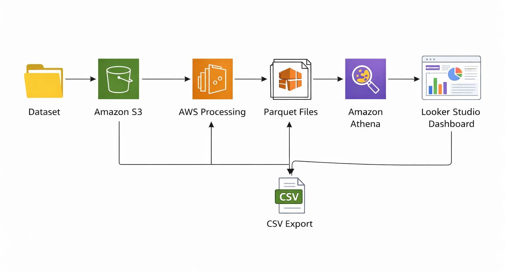
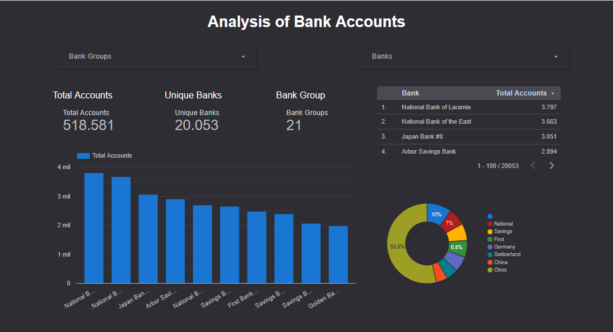

# # AWS Data Engineering Pipeline – IBM Banking Transactions


## Overview

This project demonstrates a cloud-based data engineering pipeline using AWS services to process large banking datasets.

## Architecture

## Architecture

The pipeline processes a large banking dataset using AWS cloud services.
Raw compressed data is stored in S3, processed in EC2, converted to Parquet,
queried using Athena, and visualized in Looker Studio.



Raw Dataset (large compressed files)  
↓  
AWS S3 (Data Lake Storage)  
↓  
AWS EC2 (Data processing & decompression)  
↓  
Parquet format conversion  
↓  
AWS Athena (SQL queries)  
↓  
CSV export for visualization  
↓  
Looker Studio Dashboard  

## Dataset

Due to the large size of the original dataset, only a small sample is included in this repository.

The full dataset was processed using AWS services and stored in Amazon S3.

## Technologies Used

AWS S3  
AWS EC2  
AWS Athena  
Python  
Parquet  
SQL  
Looker Studio  

## Data Processing Pipeline

1. Uploaded large compressed banking datasets to **AWS S3**.
2. Used an **EC2 instance** to decompress and prepare the raw files.
3. Converted raw data into **Parquet format** for optimized querying.
4. Created external tables in **AWS Athena** for analytical processing.
5. Queried and processed the data using **SQL in Athena**.
6. Exported the processed dataset (`2_accounts.csv`) for BI visualization.
7. Built an interactive **Looker Studio dashboard** to analyze bank accounts distribution.

## Example Athena Query

```sql
SELECT *
FROM accounts_parquet_v5
LIMIT 10;

## Dashboard


